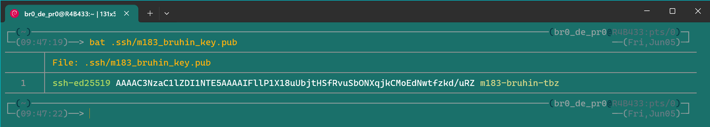
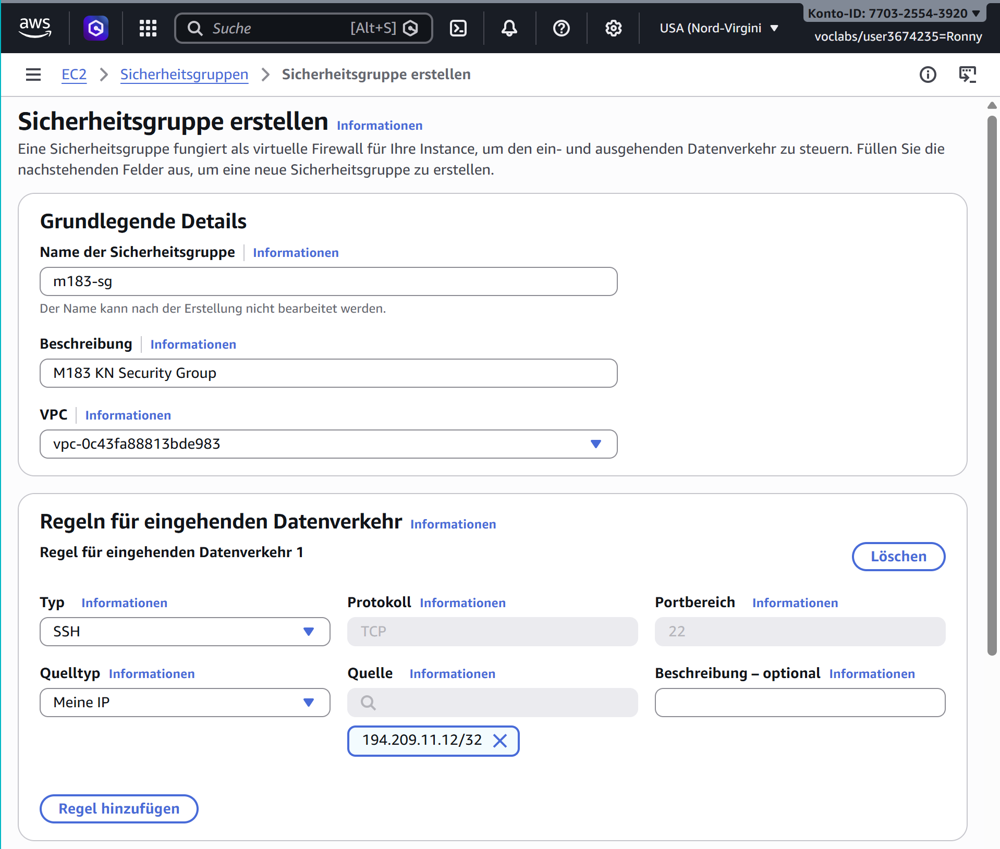

# 183 - KN00 - EC2 Setup

## B) SSH-Schlüsselpaar lokal generieren

## C) Sicherheitsgruppe erstellen

## D) EC2-Instanz mit Cloud-Init-Script starten

[cloud-init.yaml](cloud-init.yaml)

## E) SSH-Verbindung herstellen und Docker prüfen

## Leitfragen / Checkpoints

- Ich kann erklären, was ein Public Key und ein Private Key sind und worin der Unterschied liegt.

    _Der Public Key wird öffentlich geteilt und dient zur Verschlüsselung von Daten, die nur mit dem dazugehörigen Private Key entschlüsselt werden können. Der Private Key bleibt vertraulich und darf niemals weitergegeben werden._

- Ich kann erklären, warum der Private Key niemals weitergegeben werden darf.

    _Der Private Key ermöglicht den Zugriff auf die EC2-Instanz. Wenn er in die falschen Hände gerät, könnte jemand unbefugten Zugriff auf die Instanz erhalten und möglicherweise Schaden anrichten._

- Ich kann erklären, was ein Cloud-Init-Script ist und wann es ausgeführt wird.

    __
- Ich kann erklären, warum 0.0.0.0/0 als Source für SSH ein Sicherheitsrisiko ist.
- Ich kann eine EC2-Instanz mit Ubuntu AMI starten, stoppen und terminieren.
- Ich kann den Unterschied zwischen stop und terminate bei EC2-Instanzen erklären.
- Ich kann mich mit einem selbst generierten SSH-Schlüssel auf einer EC2-Instanz verbinden.
- Ich kann verifizieren, dass Docker korrekt installiert wurde und einen Container starten.