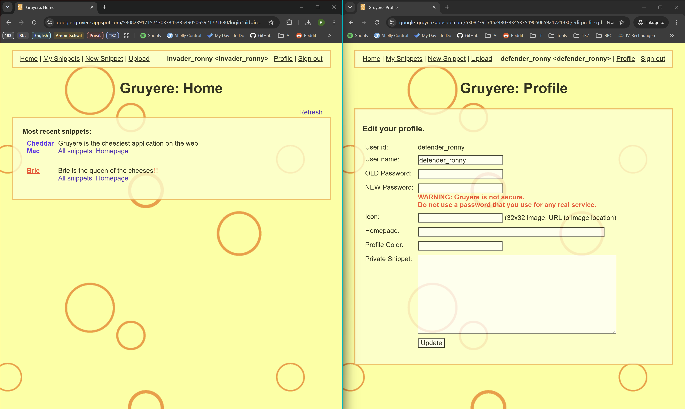
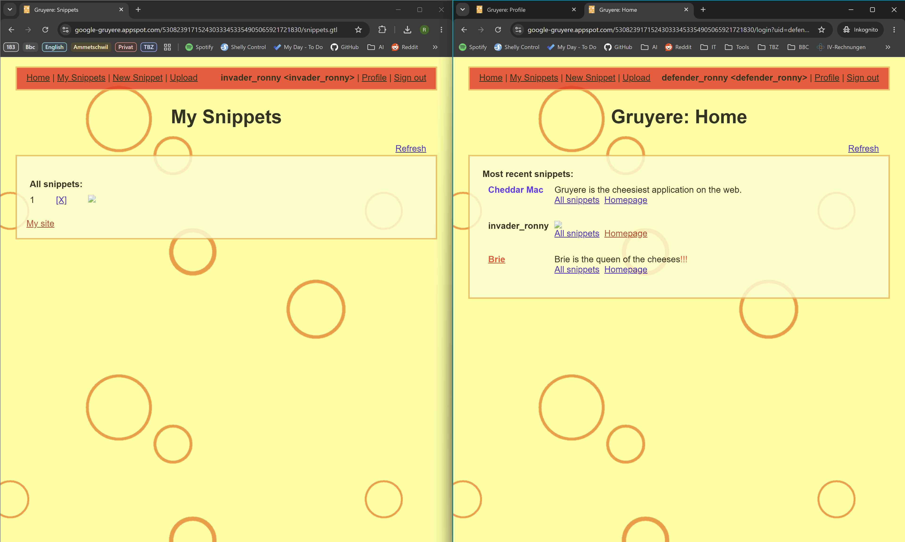
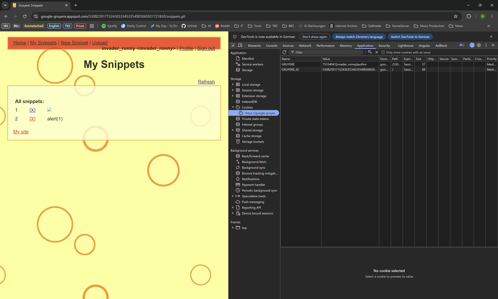
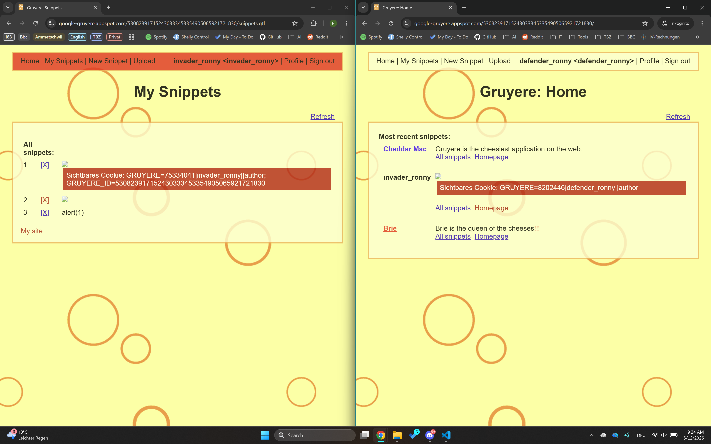
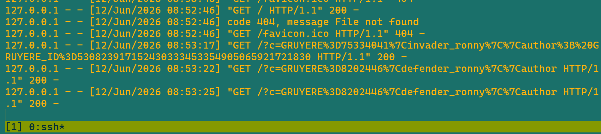
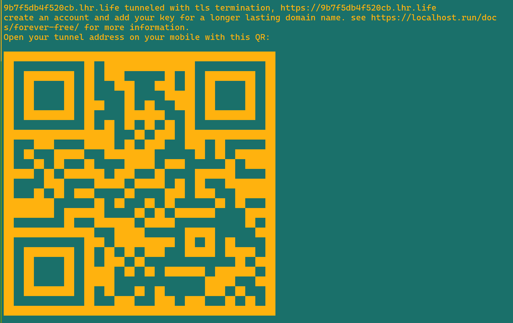
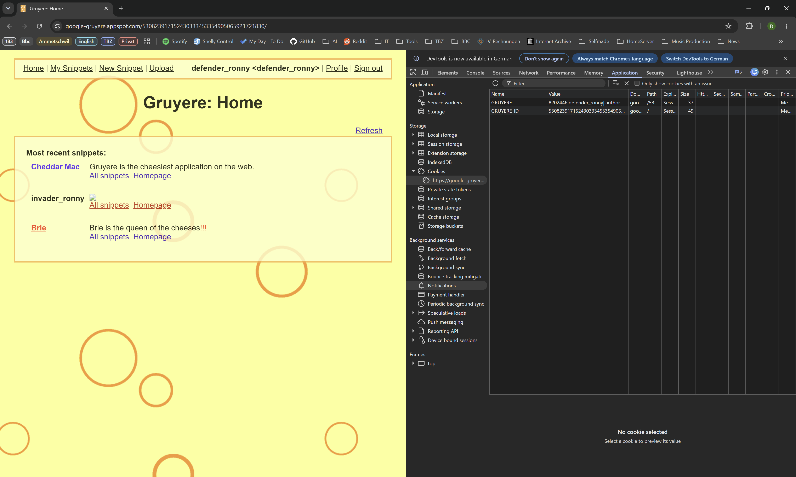

# 183 - KN01 - XSS, CSRF, Client-State Manipulation

- [A Gruyere starten und Accounts erstellen](#a-gruyere-starten-und-accounts-erstellen)
- [B Stored XSS in Gruyere](#b-stored-xss-in-gruyere)
	- [B1 - DOM-Manipulation als Proof of Concept](#b1---dom-manipulation-als-proof-of-concept)
	- [B2 – Cookies: Was sie sind und warum sie gefährlich sind](#b2--cookies-was-sie-sind-und-warum-sie-gefährlich-sind)
	- [B3 – Session-Hijacking: Cookie-Exfiltration zum Angreifer-Server](#b3--session-hijacking-cookie-exfiltration-zum-angreifer-server)
- [C Reflected XSS in Gruyere](#c-reflected-xss-in-gruyere)

M183_KN01_3
Serveo: https://a42379c259cb7d7e-54-165-155-69.serveousercontent.com

Gruyere: https://google-gruyere.appspot.com/530823917152430333453354905065921721830/

## A Gruyere starten und Accounts erstellen

## B Stored XSS in Gruyere

### B1 - DOM-Manipulation als Proof of Concept

1. Warum konnte dieser Payload die Sicherheitsprüfung des Browsers umgehen, obwohl `<script>` blockiert wird?

    Da der Payload ein reguläres HTML-Bild-Tag verwendet und `src="x"` auf ein nicht existierendes Bild verweist, wirft der Browser einen Fehler und führt automatisch den im Event-Handler `onerror` definierten JavaScript-Code aus. 

2. Was bedeutet es für die Sicherheit, dass der Payload auch im Browser des Verteidigers ausgeführt wird?

    Da der Payload auf dem Server gespeichert und an alle Benutzer ausgeliefert wird, führt dies dazu, dass der schädliche Code auch im Browser des Verteidigers ausgeführt wird.

3. Welche OWASP Top 10 Kategorie (2025) beschreibt Stored XSS? Nennen Sie Nummer und Bezeichnung.

    Stored XSS fällt unter die OWASP Top 10 Kategorie A3: Injection.

4. Was hätte die Applikation tun müssen, damit dieser Payload harmlos bleibt? (Stichwort: Output Encoding)

    Die Applikation hätte den Payload vor der Ausgabe an die Benutzer ordnungsgemäß encodieren müssen, um sicherzustellen, dass er als reiner Text und nicht als ausführbarer Code interpretiert wird. Zum Beispiel könnte sie HTML-Entities verwenden, um `<` in `&lt;` und `>` in `&gt;` umzuwandeln.

---

### B2 – Cookies: Was sie sind und warum sie gefährlich sind

- Screenshot der DevTools mit sichtbarem Cookie-Wert.

- Screenshot des roten Kastens im Fenster des Angreifers (eigenes Cookie).

- Screenshot des roten Kastens im Fenster des Verteidigers (Cookie des Verteidigers).

- Schriftliche Antworten auf die drei Fragen.

1. Was kann ein Angreifer tun, wenn er den Session-Cookie eines anderen Benutzers kennt?

    Da das Cookie die Identität des Nutzers gegenüber dem Server legitimiert, ist der Angreifer sofort als Opfer eingeloggt - ohne dass er das Passwort des Opfers kennen muss. 

2. Was bewirkt das HttpOnly-Flag bei einem Cookie und wie schützt es vor diesem Angriff?

    Das HttpOnly-Flag verhindert, dass der Cookie-Wert über clientseitiges JavaScript ausgelesen werden kann. Dadurch wird es für Angreifer schwieriger, den Session-Cookie zu stehlen, da er nicht über XSS-Angriffe oder andere JavaScript-Exploits zugänglich ist.

3. Warum ist es gefährlich, Session-Cookies im localStorage statt in einem HttpOnly-Cookie zu speichern?

    Auf den localStorage kann immer per JavaScript zugegriffen werden (localStorage.getItem(...)) auch wenn das HttpOnly-Flag gesetzt ist. Es gibt dort kein Äquivalent zum HttpOnly-Flag, weshalb Angreifer, die eine XSS-Schwachstelle ausnutzen, problemlos auf die Session-Cookies zugreifen und sie stehlen können.

---

### B3 – Session-Hijacking: Cookie-Exfiltration zum Angreifer-Server

Abgabe B3:

- Screenshot von SSH-Terminal 1 (Python-Server) mit der eingehenden GET-Anfrage (Cookie sichtbar).
    
- Screenshot von SSH-Terminal 2 (Serveo) mit der zugewiesenen HTTPS-URL.
    
- Screenshot des Gruyere-Fensters des Angreifers nach der Cookie-Übernahme, mit dem Benutzernamen des Verteidigers sichtbar.
    
- Schriftliche Antworten auf die fünf Fragen:

    1. Warum konnte der Angreifer den Cookie des Verteidigers erhalten, ohne je dessen Passwort zu kennen oder Zugriff auf dessen Browser zu haben?

    __

    2. Welche Rolle spielt der new Image().src-Trick – warum funktioniert diese Technik trotz Same-Origin-Policy?

    __

    3. Warum war der Serveo-Tunnel notwendig – was wäre passiert, wenn der Payload direkt http://<EC2-IP>:9000 verwendet hätte?    

    __

    4. Nennen Sie mindestens zwei technische Massnahmen, mit denen die Webapplikation diesen Angriff verhindert hätte.

    __

    5. Was bewirkt das Secure-Flag bei einem Cookie, und in welcher Situation schützt es?

    __

## C Reflected XSS in Gruyere

https://google-gruyere.appspot.com/530823917152430333453354905065921721830/login?uid=defender_ronny&pw=%2BA7S22O%27s0%7Ex

- Screenshot von DevTools → Network → Response mit dem Payload im HTML-Quelltext.
- Screenshot des ausgeführten Alerts mit dem Payload sichtbar in der URL.
- Schriftliche Antworten auf die drei Fragen:
    1. Was ist der Hauptunterschied zwischen Stored XSS und Reflected XSS hinsichtlich Persistenz und Reichweite? (Antwort aus Schritt 3 ableiten)
    2. Wie würde ein Angreifer in der Praxis vorgehen, um das Opfer dazu zu bringen, den manipulierten Link zu öffnen? (Social Engineering)
    3. Welcher OWASP Proactive Control schützt am direktesten gegen XSS? Nennen Sie ihn mit Nummer und Titel. (Referenz: owasp.org/www-project-proactive-controls)

## D Client-State Manipulation in Gruyere

- Screenshot der DevTools mit sichtbarem Cookie-Inhalt (vor der Manipulation).
- Screenshot der Applikation nach erfolgreicher Manipulation (erhöhte Rechte sichtbar).
- Schriftliche Antworten auf die drei Fragen:
    1. Warum ist es gefährlich, sicherheitsrelevante Daten (wie Rollen oder Berechtigungen) im Client (Cookie/LocalStorage) zu speichern?
    2. Wo sollten Berechtigungsprüfungen stattfinden – im Client oder auf dem Server? Begründen Sie.
    3. Welche OWASP Top 10 Kategorie (2025) beschreibt dieses Problem?