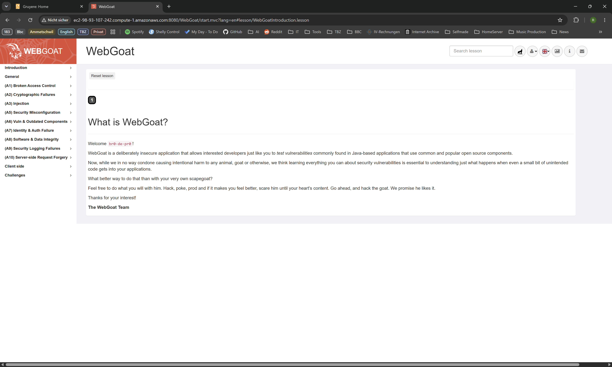
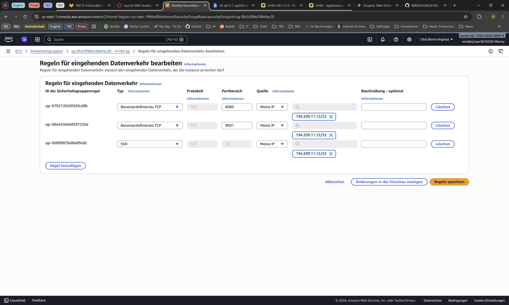
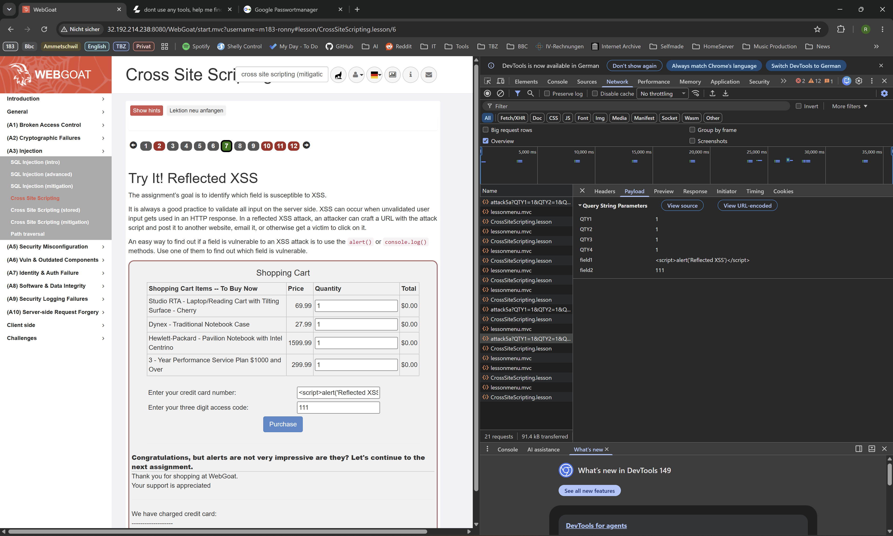
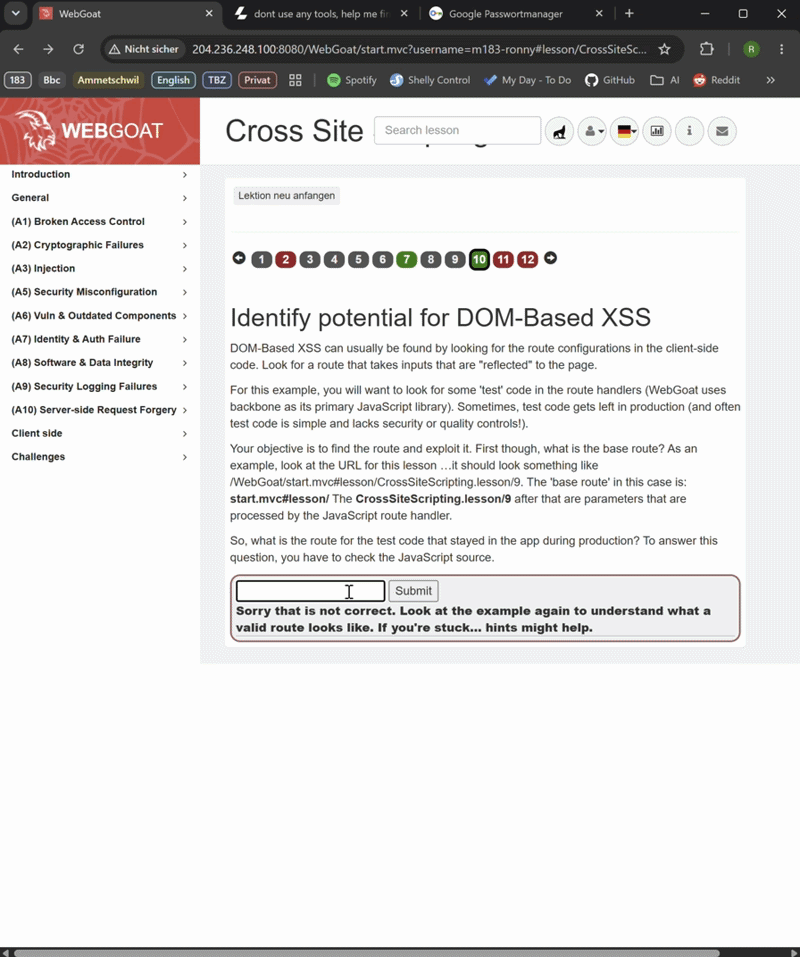
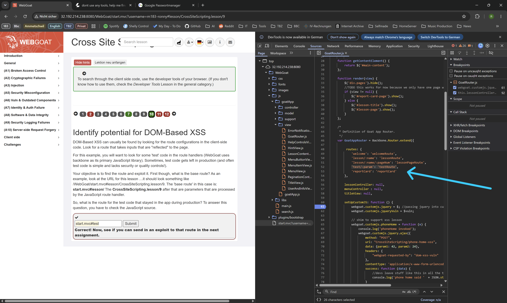
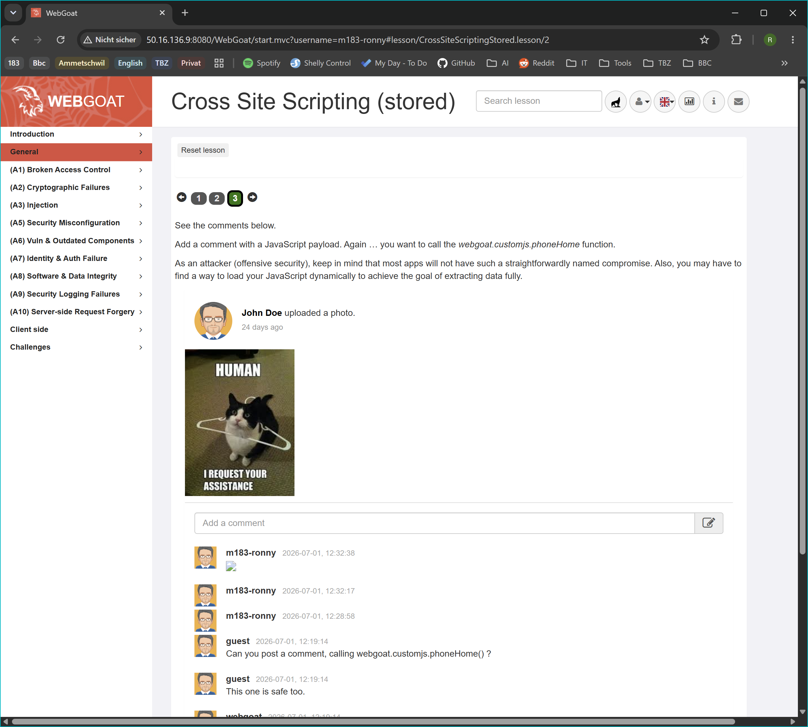
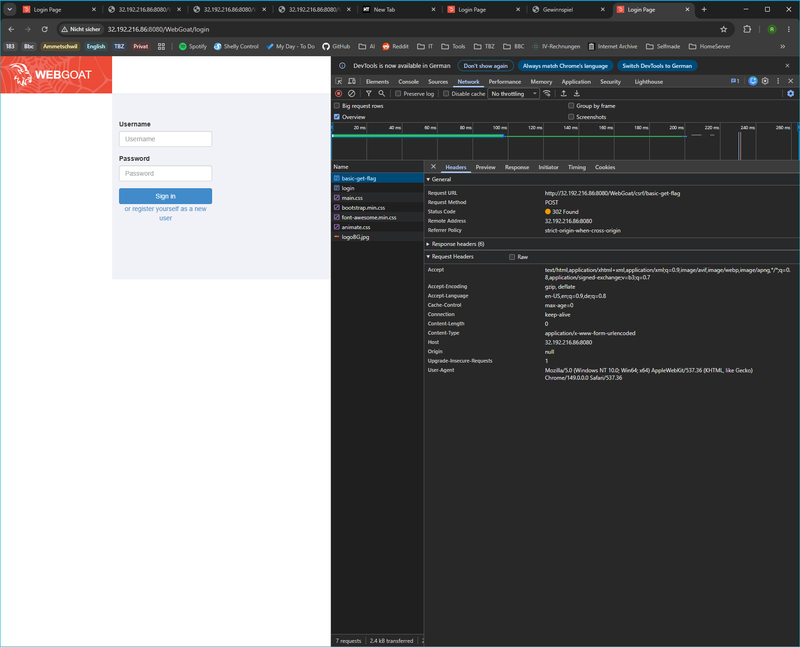
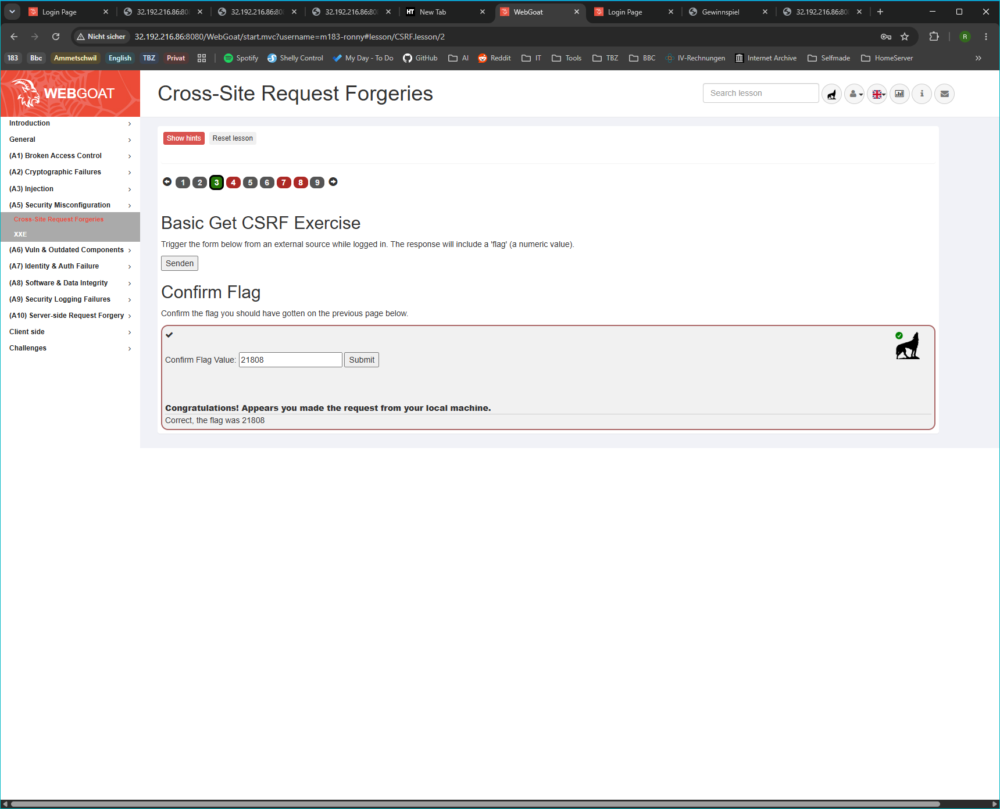
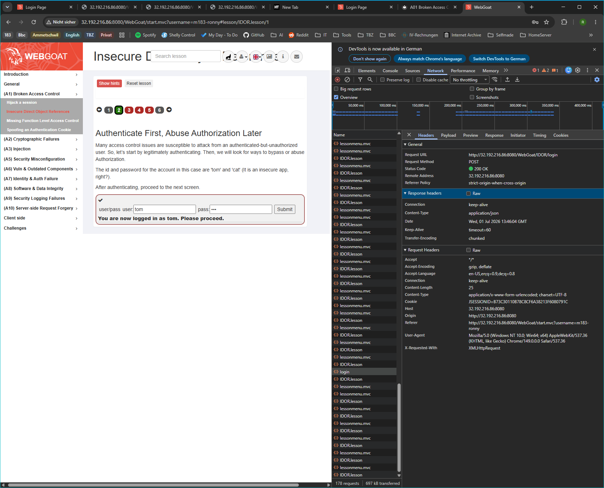

# 183 - KN02 - SQL Injection, XSS, CSRF, IDOR, JWT

## A WebGoat starten




## B SQL Injection

1. Zeichnen Sie auf, wie das SQL-Statement aus B1 vor und nach dem Einschleusen des Payloads aussieht. Erklären Sie, warum die Authentifizierung dadurch umgangen wird.

    
    


    **Vor dem Einschleusen (Soll-Zustand)**
    
    _Die Applikation erwartet eine Zahl im Feld `User_Id` (bzw. `Login_Count`), um einen spezifischen Benutzer zu filtern._
    ```sql
    SELECT * FROM user_data WHERE Login_Count = 1 AND userid = [EINGABE];
    ```

    _Wenn ein Benutzer die ID `105` eingibt, sucht die Datenbank exakt nach dieser ID. Gibt es sie nicht bleibt das Ergebnis leer und der Zugriff wird verweigert._

    **Nach dem Einschleusen (Ist-Zustand)**

    _Durch die Eingabe von `1 OR 1=1 -- ` (oder einer funktionierenden Variante wie `1 OR TRUE -- `) wird das Statement strukturell verändert:_
    ```sql
    SELECT * FROM user_data WHERE Login_Count = 1 AND userid = 1 OR 1=1 --;
    ```

    **Warum die Authentifizierung umgangen wird?**

    _Der Datenbank-Parser wertet die `WHERE`-Bedingung logisch aus. Durch das `OR 1=1 -- ` wird eine Bedingung hinzugefügt, die **immer wahr (TRUE)** ist._
    - Da das `--` den restlichen Teil der originalen Abfrage auskommentiert (abschneidet), lautet die logische Prüfung für die Datenbank im Kern nur noch: _„Gib die Zeile aus, wenn die ID 1 ist ODER wenn 1 gleich 1 ist“._

    - Weil `1=1` für jede einzelne Zeile in der Tabelle zutrifft, ignoriert die Datenbank die Identitätsprüfung und gibt `alle Datensätze` an die Applikation zurück. Die Applikation sieht ein erfolgreiches Datenbank-Ergebnis und gewährt fälschlicherweise Zugriff.

---

2. Wie funktionieren Prepared Statements (parameterisierte Abfragen) technisch? Warum kann SQL Injection damit nicht mehr funktionieren?

    Bei einem **Prepared Statement** (parametrierte Abfrage) trennt die Webapplikation den ausführbahen SQL-Code strikt von den variablen Benutzerdaten. Das geschieht in zwei Schritten:

    1. **Kompilierung (Prepare):** Die Applikation sendet das SQL-Grundgerüst mit Platzhaltern (`?`) an die Datenbank:

        ```sql
        SELECT * FROM user_data WHERE Login_Count = ? AND userid = ?;
        ```

        Die Datenbank analysisert diese Struktur, baut den Ausführungsplan auf und legt fest, was Code und was Daten sind. Die Struktur steht ab diesem Moment felsenfest.

    2. **Einfügen der Parameter (Execute):** Erst danach werden die Benutzereingaben (z.B. `1 OR 1=1`) als reine Parameter an die Platzhalter übergeben.

    **Warum SQL Injection damit unmöglich wird**

    Da die Datenbank den SQL-Befehl bereits in Schritt 1 fertig kompiliert hat, kann die Benutzereingabe die logische Struktur des Befehls nicht mehr verändern.

    Gibt ein Angreifer `1 OR 1=1`  ein, sucht die Datenbank buchstäblich nach einem Benutzer, dessen ID exakt der String `1 OR "1 OR 1=1"` ist. Der Payload wird wie harmloser Freitext behandelt und verliert jegliche subversive Wirkung.

---

3. Welche OWASP Top 10 Kategorie (2025) beschreibt SQL Injection? Nennen Sie Nummer und Bezeichnung.

    [**A05:2025-Injection**](https://owasp.org/Top10/2025/A05_2025-Injection/)


---
4. Nennen Sie neben SQL Injection zwei weitere Injection-Varianten (z.B. OS Command Injection, LDAP Injection) und beschreiben Sie kurz, was dabei injiziert wird und wo die Gefahr liegt.

    1. **OS Command Injection** (Betriebssystem-Befehlsinjektion)

        - **Was wird injiziert?** Systembefehle des zugrundeliegenden Betriebssystems (z. B. `; rm -rf /` oder `& dir`), verpackt in Eingabefelder, die Parameter an Systemprozesse übergeben.

        - **Wo liegt die Gefahr?** Wenn eine Webapplikation z. B. ein Ping-Tool bereitstellt und die IP-Eingabe ungefiltert an die System-Shell übergibt, kann ein Angreifer über Trennzeichen eigene Befehle anhängen. Die Gefahr reicht von der Offenlegung sensibler Systemdateien bis zur vollständigen Übernahme des Webservers (Remote Code Execution).

    2. **LDAP Injection** (Lightweight Directory Access Protocol)

        - **Was wird injiziert?** Steuerzeichen für Verzeichnisdienste (z. B. `*`, `(`, `)`, `&`, `|`), die in Abfragen an ein Active Directory oder ein LDAP-Verzeichnis eingebettet werden.

        - **Wo liegt die Gefahr?** Viele Unternehmen nutzen LDAP für das Single-Sign-On (Mitarbeiter-Login). Wird die Eingabe nicht bereinigt, kann ein Angreifer die LDAP-Suchfilter manipulieren (analog zu SQLi). Die Gefahr liegt im Umgehen der Login-Maske oder dem unbefugten Auslesen von Mitarbeiter- und Strukturdaten aus dem Firmennetzwerk.
---

## C Cross-Site Scripting (XSS)


Original Payload
QTY1=1&QTY2=1&QTY3=1&QTY4=1&field1=1234&field2=111

Angepasster Payload
QTY1=1&QTY2=1&QTY3=1&QTY4=1&field1=%3Cscript%3Ealert(%27Reflected%20XSS%27)%3C%2Fscript%3E&field2=111


Abgabe C:

- Screenshot des ausgelösten Alerts bei C1a (Reflected) mit dem Payload sichtbar im Eingabefeld oder Response.

    

- Screenshot der C1b-Analyse: welche Codezeile(n) Sie als verwundbar markiert haben.

    
    

- Screenshot des ausgelösten Alerts bei C2 (Stored) nach dem Speichern des Kommentars.
    
    

- Screenshot der gelösten WebGoat-Aufgabe C2 (grüne Bestätigung).

    
    

- Schriftliche Antworten auf die fünf Fragen:

    1. Was ist der zentrale Unterschied zwischen Reflected XSS und Stored XSS hinsichtlich Persistenz und Reichweite?

        **Persistenz:** 
        - _**Reflected XSS** ist flüchtig. Der Payload befindet sich im Link/Request und wird vom Server sofort einmalig zurückgespiegelt._

        - _**Stored XSS** ist dauerhaft (persistent). Der Payload wird direkt in der Datenbank des Servers gespeichert._

        **Reichweite:**

        - _**Reflected XSS** trifft **nur gezielte Opfer**, die aktiv auf einen manipulierten Link klicken._

        - _**Stored XSS** trifft **alle Benutzer**, die die betroffene Seite aufrufen._

    2. Was unterscheidet DOM-based XSS von Reflected XSS – warum ist DOM-based XSS für serverseitige Filter schwieriger zu erkennen?

        **Unterschied:**

        _Reflected XSS wird vom Server in das HTML eingebaut. DOM-based XSS geschieht im Client-Browser, weil ein dortiges JavaScript-Skript Daten unsicher verarbeitet._

        **Warum schwerer zu erkennen:**

        _Bei DOM-based XSS wird der Payload (z.B. nach einem `#` in der URL) oft gar nicht an den Server übermittelt. Da der Server die Schadsoftware im HTTP-Request nie zu Gesicht bekommt, laufen serverseitige Filter komplett ins Leere._

    3. Was bedeutet Output Encoding und warum schützt es gegen XSS? Geben Sie ein konkretes Beispiel, wie `<script>` nach dem Encoding aussieht.

        **Bedeutung & Schutz:**

        _Es wandelt potenziell gefährliche Steuerzeichen (wie `<` oder `>`) in sichere HTML-Entitäten um. Der Browser interpretiert die Eingabe dadurch nicht mehr als ausführbaren Code, sondern als reinen Text._

        **Beispiel:**

        ```plaintext
        &lt;script&gt;
        ```
        
    4. Was ist der HTTP-Header `Content-Security-Policy` (CSP) und wie schränkt er XSS ein? (Recherchieren Sie falls nötig.)

        **Definition:** 
        
        _Ein HTTP-Response-Header, mit dem der Server dem Browser eine Whitelist vertrauenswürdiger Datenquellen und Skripte vorgibt._
        
        **XSS-Einschränkungen:**

        _Selbst weinn ein Angreifer erfolgreich HTML-Code injiziert, blockiert die CSP die Ausführung, indem sie beispielsweise das Ausführen von Inline-Skripten (`<script>...</script>`) oder das Nachladen von Code von fremden Domänen strikt verbietet._

    5. Welche OWASP Top 10 Kategorie (2021) beschreibt XSS? Nennen Sie Nummer und Bezeichnung.

        _A03:2021-Injection_

## D Cross-Site Request Forgery (CSRF)

- Den Inhalt der csrf-attack.html-Datei (Screenshot oder Code-Block).
    ```html
    <!DOCTYPE html>
    <html>
    <head>
        <title>Gewinnspiel</title>
    </head>
    <body>
        <h1>Glückwunsch! Sie haben gewonnen!</h1>
        <p>Klicken Sie auf den Button, um Ihren Preis einzulösen:</p>
        
        <form id="csrfForm" action="http://32.192.216.86:8080/WebGoat/csrf/basic-get-flag" method="POST">
            <input type="submit" value="HIER PREIS ABHOLEN" style="padding: 10px 20px; font-size: 16px; background-color: green; color: white; border: none; cursor: pointer;">
        </form>
    </body>
    </html>
    ```
- Screenshot der analysierten Netzwerk-Anfrage aus DevTools (URL, Methode und Parameter sichtbar).

    
- Screenshot, der zeigt, dass der Angriff erfolgreich war (grüne WebGoat-Bestätigung).

    
- Schriftliche Antworten auf die vier Fragen:
    1. Warum schickt der Browser den Session-Cookie mit, wenn die Anfrage von `csrf-attack.html` (einer lokalen Datei) kommt – obwohl das Opfer diese Seite nie bewusst besucht hat?

        _Der Browser unterscheidet standardmäßig nicht, wer oder welche Website eine Anfrage auslöst, sondern nur, an wen sie gerichtet ist. Da die Ziel-URL in der `csrf-attack.html` auf die IP-Adresse der WebGoat-Instanz verweist, greift der automatische Cookie-Mechanismus des Browsers: Er packt alle für diese Domäne/IP gültigen Session-Cookies ungefragt in den HTTP-Header, solange der Benutzer dort im selben Browser noch parallel eingeloggt ist._

    2. Was ist ein CSRF-Token und warum kann eine Angreifer-Seite ihn nicht einfach aus dem Formular lesen?

        **Was es ist:** 

        _Ein CSRF-Token ist ein kryptografisch sicherer, zufälliger und einmaliger Wert, den der Server generiert und fest an die aktuelle Session des Nutzers bindet. Dieses Token muss bei jeder sensitiven Anfrage (z. B. POST) zwingend mitgeschickt werden._

        **Wie es funktioniert:**

        _Aufgrund der **Same-Origin-Policy (SOP)** des Browsers ist es einer fremden Website (oder einer lokalen HTML-Datei) strengstens untersagt, die Inhalte oder das DOM einer anderen Domäne (WebGoat) auszulesen. Der Angreifer kann das Formular zwar blind abschicken, das geheime Token darin aber weder sehen noch im Vorfeld stehlen._

    3. Was bewirkt das `SameSite=Strict`-Flag bei einem Cookie und wie schützt es vor CSRF?

        **Wirkung:**

        _Das Flag `SameSite=Strict` weist den Browser an, das Cookie **ausschliesslich dann** mitzusenden wwernn die Anfrage von derselben Domäne (Origin) stammt, die auch in der Adressleiste des Browsers steht._

        **CSRF-Schutz:**

        _Sobald ein Link oder ein Formular von einer externen Seite (oder einer lokalen Datei wie `csrf-attack.html`) aufgerufen wird, blockiert der Browser das Mitsenden des Session-Cookies komplett. Da der Server die Anfrage ohne das Cookie als "nicht eingeloggt" einstuft, läuft der CSRF-Angriff ins Leere._

    4. Welche OWASP Top 10 Kategorie (2025) beschreibt CSRF am ehesten? Nennen Sie Nummer und Bezeichnung.

        _A01:2025 - Broken Access Control_

## E Broken Access Control - (IDOR)
- Screenshot des gelesenen fremden Profils mit sichtbarer Profil-ID in der URL oder im Response.


- Screenshot oder Command der erfolgreichen Veränderung (WebGoat-Bestätigung sichtbar).
- Schriftliche Antworten auf die vier Fragen:

    1. Warum reicht es nicht, eine Ressource einfach «nicht zu verlinken», um sie zu schützen? (Stichwort: Security through Obscurity)
    2. Wie hätte die Applikation den IDOR-Angriff verhindern können? Beschreiben Sie die notwendige serverseitige Prüfung.
    3. Was ist der Unterschied zwischen horizontaler und vertikaler Privilegienerweiterung? Welche Form zeigt dieses IDOR-Beispiel?
    4. Welche OWASP Top 10 Kategorie (2025) beschreibt Broken Access Control? Nennen Sie Nummer und Bezeichnung und erklären Sie, warum sie auf Platz 1 steht.

## F Broken Authentication (JWT)

- Screenshot von jwt.io mit dem analysierten Original-Token (Payload sichtbar, Algorithmus sichtbar).
- Den vollständigen manipulierten Token (als Text oder Screenshot).
- Screenshot der grünen Bestätigung in WebGoat nach dem erfolgreichen Angriff.
- Schriftliche Antworten auf die vier Fragen:

    1. Warum ist es ein Sicherheitsproblem, wenn ein Server `"alg":"none"` akzeptiert?
    2. JWT-Payloads sind nur Base64url-kodiert, nicht verschlüsselt. Was bedeutet das für den Umgang mit sensiblen Daten im Token?
    3. Welche Massnahmen schützen gegen JWT-Angriffe? Nennen Sie mindestens drei (z.B. Algorithmus-Whitelist, kurze Ablaufzeiten, serverseitige Signaturprüfung).
    4. Welche OWASP Top 10 Kategorie (2021) beschreibt Broken Authentication? Nennen Sie Nummer und Bezeichnung.