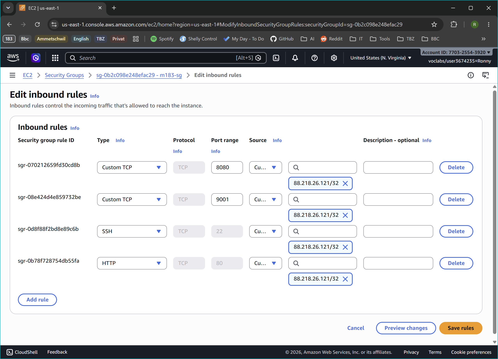
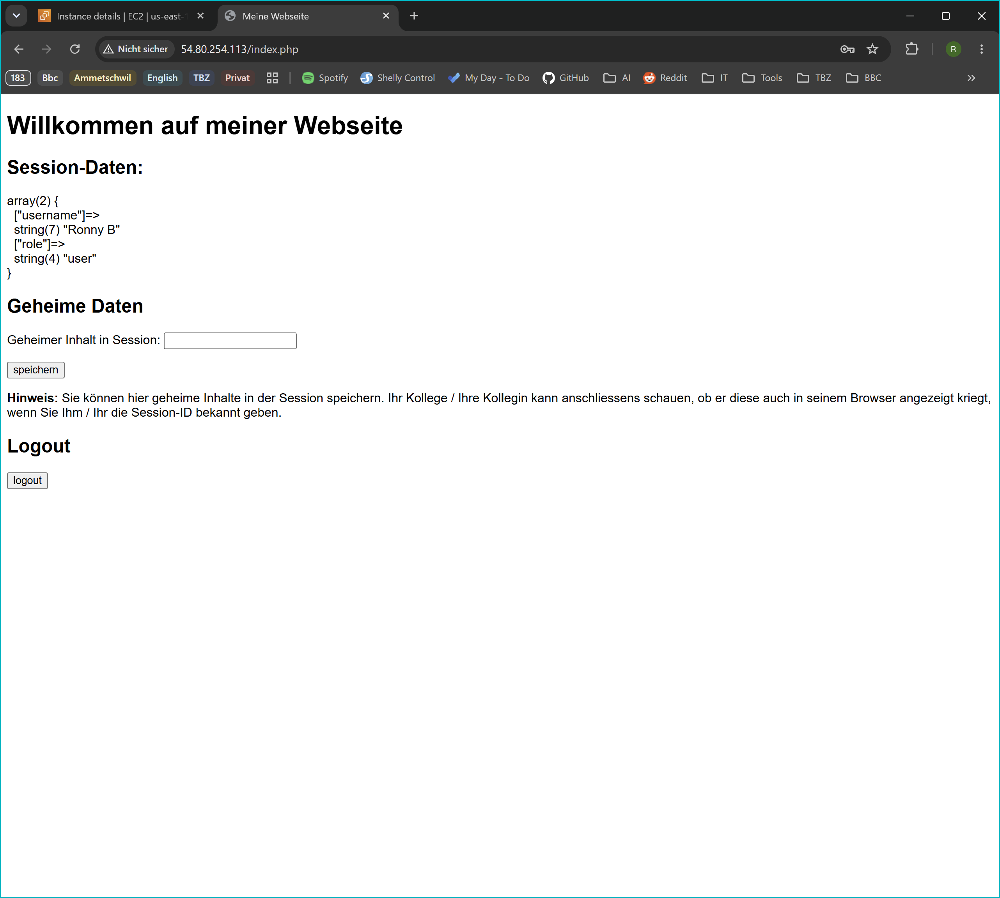
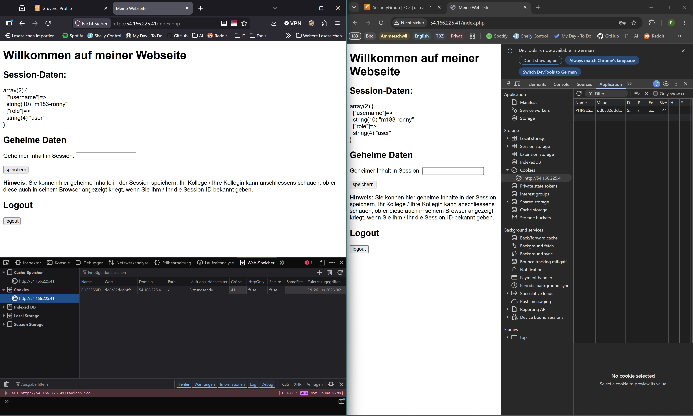

# 183 - KN03 - Session Handling

- [A Sicherheitsgruppe erweitern und App deployen](#a-sicherheitsgruppe-erweitern-und-app-deployen)
- [B Sicherheitslücken in der App analysieren](#b-sicherheitslücken-in-der-app-analysieren)
- [C Session-Fixation demonstrieren](#c-session-fixation-demonstrieren)
- [D Sicherheitslücken beheben](#d-sicherheitslücken-beheben)
- [E MFA-Faktoren erklären](#e-mfa-faktoren-erklären)
- [Leitfragen / Checkpoints](#leitfragen--checkpoints)

## A Sicherheitsgruppe erweitern und App deployen

_Angepasste Security Group für KN03_

_Meine Webseite mit angezeigten Session-Daten_

---

## B Sicherheitslücken in der App analysieren

Aufgabe B: Gehen Sie den Code durch und benennen Sie die fünf Sicherheitslücken mündlich.

1. **Fehlende Passwortüberprüfung (Broken Authentication)**
    - **Das Problem:** Der Code prüft lediglich `if(isset($_POST['login]))` und übernimmt den Benutzernamen unvalidiert in die Session. Das übermittelte Passwort wird vom Skript komplett ignoriert. Jeder kann sich mit jedem Benutzernamen (oder sogar ganz ohne Passwort) einloggen.

    - **Schutzziel:** Vertraulichkeit
    
    - **OWASP:** **A07:2025 - Authentication Failures**    

2. **Session Fixation (Fehlende Erneuerung der Session-ID)**
      - **Das Problem:** Nach dem Login wird die Funktion `session_regenerate_id()` nicht aufgerufen. Die Session-ID bleibt vor und nach dem Login identisch. Ein Angreifer kann dem Opfer eine bekannte Session-ID unterschieben und nach dem Login des Opfers diese Session übernehmen.

    - **Schutzziel:** Vertraulichkeit, Integrität

    - **OWASP:** **A07:2025 - Authentication Failures**

3. **Insecure Direct Object Reference/ Broken Access Control (Feste Rollenvergabe)**
     - **Das Problem:** Die Admin-Rolle wird vergeben, sobald der eingegebene Benutzername exakt `admin` lautet (`if($_SESSION['username'] == 'admin')`). Da keine Passwortprüfung stattfindet, kann sich jeder Nutzer trivial administrative Rechte zuweisen.

    - **Schutzziel:** Vertraulichkeit, Integrität

    - **OWASP:** **A01:2025 - Broken Access Control**

4. **Unsichere Cookie-Konfiguration (Security Misconfiguration)**
     - **Das Problem:** Es werden keine sicheren Cookie-Parameter gesetzt (z.B. fehlen, `HttpOnly`, `Secure`, `SameSite`). Dadurch können Session-Cookies durch Cross-Site Scripting (XSS) per JavaScript gestohlen oder über unverschlüsselte Verbindungen abgefangen werden.

    - **Schutzziel:** Vertraulichkeit

    - **OWASP:** **A02:2025 - Security Misconfiguration**

5. **Fehlender Schutz vor Cross-Site Request Forgery (CSRF)**
     - **Das Problem:** Weder beim Login, noch beim Speichern der Nachricht, noch beim Logout wird ein Anti-CSRF-Token verwendet. Ein Angreifer könnte einen authentifizierten Nutzer dazu bringen, unbemerkt Aktionen auszuführen.

    - **Schutzziel:** Integrität

    - **OWASP:** **A01:2025 - Broken Access Control**

---

## C Session-Fixation demonstrieren

Aufgabe C: Demonstrieren Sie den Session-Fixation-Angriff in zwei Browsern live und erklären Sie was passiert.

- Was ist passiert? Konnte der zweite Browser auf die Session des ersten zugreifen?
    
    _Die Session-ID wurde manuell aus dem ersten Browser ausgelesen und in den zweiten Browser übertragen. Nach der erfolgreichen Anmeldung im ersten Browser wurde diese spezifische Session-ID serverseitig als authentifiziert markiert. Beim anschliessenden Neuladen des zweiten Browsers wurde dieselbe, nun authentifizierte Session-ID an den Server übermittelt._

- Warum ist das ein Sicherheitsproblem?

    _Dieser Vorgang demonstriert eine Schwachstelle namens Session Fixation (Sitzungsfixierung). Ein Angreifer kann eine gültige Session-ID generieren und diese einem potenziellen Opfer im Voraus zuweisen (beispielsweise über einen präparierten Link). Sobald sich das Opfer mit seinen legitimen Zugangsdaten anmeldet, wird die vom Angreifer kontrollierte Session serverseitig authentifiziert. Da der Angreifer die Session-ID bereits kennt, erlangt er ab diesem Zeitpunkt unautorisierten Vollzugriff auf das Konto des Opfers, ohne dessen Passwort kompromittieren zu müssen._

- Welche eine Massnahme hätte diesen Angriff verhindert?

    _Die Implementierung der Funktion session_regenerate_id(true) unmittelbar nach der erfolgreichen Validierung der Anmeldedaten. Diese Massnahme bewirkt, dass die bisherige (und potenziell bereits bekannte) Session-ID serverseitig gelöscht und durch eine neu generierte ID ersetzt wird. Ein Angreifer verliert dadurch den Zugriff, da seine zuvor fixierte Session-ID ihre Gültigkeit verliert._

---

## D Sicherheitslücken beheben

_Cookies vor dem Fix_

_Cookies nach dem Fix: Das Passwort wurde beim ersten Versuch bewusst falsch eingegeben_
 
- Schriftliche Antworten auf die drei Fragen:

    - Was bewirkt `HttpOnly` auf einem Cookie? Gegen welchen Angriff schützt dieses Flag?

        _Das Flag `HttpOnly` weist den Browser an, den Zugriff auf das Cookie durch clientseitige Skripte (wie JavaScript via `document.cookie`) strikt zu blockieren._

        _**Schutz vor:** Cross-Site Scripting (XSS). Es verhindert, dass Angreifer durch eingeschleuste bösartige Skripte Session-Cookies auslesen und stehlen können._
        
    - Was bewirkt `SameSite=Strict?` Gegen welchen Angriff schützt dieses Flag?

        _Das Flag `SameSite=Strict` verhindert, dass der Browser das Cookie bei domainübergreifenden Anfragen (Cross-Site Requests) mitsendet – selbst dann nicht, wenn der Benutzer auf einen Link von einer externen Seite klickt._

        _**Schutz vor:** Cross-Site Request Forgery (CSRF). Externe Webseiten können dadurch keine unbemerkten Aktionen mehr in der authentifizierten Sitzung des Benutzers auslösen._

    - Warum wurde `password_hash()` mit `PASSWORD_ARGON2ID` und nicht mit MD5 oder SHA-1 verwendet?

        _MD5 und SHA-1 sind veraltete, generische und sehr schnelle Hash-Funktionen. Diese Geschwindigkeit macht sie extrem anfällig für Brute-Force- und Rainbow-Table-Angriffe, da Angreifer Milliarden von Kombinationen in Sekunden durchprobieren können._

        _**Argon2ID** hingegen ist ein dedizierter, speicher- und rechenintensiver moderner Passwort-Hashing-Algorithmus. Er bietet folgende Vorteile:_

        - _Er generiert automatisch bei jedem Aufruf einen individuellen, kryptografisch sicheren Salt._

        - _Er verzögert den Hashing-Prozess künstlich (Key Stretching/Work Factor), wodurch Offline-Angriffe und das massenhafte Durchprobieren von Passwörtern extrem zeitaufwändig, ressourcenintensiv und damit unpraktikabel werden._

---

## E MFA-Faktoren erklären

| Kategorie | Beschreibung | Beispiel 1 | Beispiel 2 |
|-----------|-------------|------------|------------|
| **Wissen** | Etwas das Sie wissen | Passwort | Antwort auf Sicherheitsfrage|
| **Besitz** | Etwas das Sie besitzen | Schlüssel | Smartphone |
| **Inhärenz** | Etwas das Sie sind | Fingerabdruck | Gesichtserkennung |
| **Ort** | Wo Sie sich befinden | bekannte IP-Adresse | GPS-Standort |

- **Ist die Kombination «Passwort + PIN» echtes MFA? Begründen Sie.**

    _**Nein.** Bei echtem MFA müssen zwingend Faktoren aus unterschiedlichen Kategorien kombiniert werden. Sowohl das Passwort als auch die PIN gehören zur selben Kategorie, nämlich Wissen. Ein Angreifer, der in der Lage ist, Ihr Passwort durch einen Keylogger oder Phishing abzufangen, könnte auf demselben Weg auch Ihre PIN erbeuten. Dies erhöht die Sicherheit zwar geringfügig (Two-Step Verification), ist aber keine echte Mehrfaktorauthentifizierung._

- **Ist die Kombination «Passwort + SMS-Code» echtes MFA? Begründen Sie.**

    _**Ja.** Diese Kombination verwendet Faktoren aus zwei unterschiedlichen Kategorien. Das Passwort gehört zur Kategorie Wissen. Der SMS-Code beweist, dass Sie Zugriff auf das verknüpfte Mobiltelefon haben, was die Kategorie Besitz abdeckt. Selbst wenn ein Angreifer Ihr Passwort kennt, kann er sich ohne den physischen Zugriff auf Ihr Smartphone nicht einloggen. (Hinweis: SMS gilt heutzutage aufgrund von Angriffen wie SIM-Swapping als der schwächste Besitz-Faktor, erfüllt aber formell die Definition von MFA)._

- **AWS STS (Security Token Service) stellt temporäre Zugangsdaten aus. Welchem MFA-Prinzip ähnelt dieses Konzept am meisten, und warum?**

    _Das Konzept von temporären Zugangsdaten ähnelt am ehesten dem Prinzip eines **zeitbasierten Einmalpassworts (TOTP)**, wie es oft bei Authenticator-Apps in der Kategorie Besitz eingesetzt wird.
    Der Kerngedanke dahinter ist die strenge zeitliche Befristung. Bei AWS STS sind die Zugangsdaten (Access Key, Secret Key, Session Token) nur für einen kurzen, vordefinierten Zeitraum gültig (z. B. 15 Minuten). Dies setzt das Prinzip der minimalen Rechte (Least Privilege) auf einer zeitlichen Ebene um. Selbst wenn diese temporären Daten gestohlen werden, ist das Zeitfenster für einen Missbrauch durch einen Angreifer stark minimiert, ähnlich wie bei einem MFA-Token, das nach 30 Sekunden verfällt._

---

## Leitfragen / Checkpoints

- Ich kann erklären, was Session Fixation ist und wie `session_regenerate_id(true)` dagegen schützt.

    - _**Session Fixation:** Ein Angreifer generiert eine gültige Session-ID und jubelt diese dem Opfer unter (z.B. per Link). Meldet sich das Opfer mit dieser ID an, wird die Session auf dem Server als "eingeloggt" markiert. Da der Angreifer die ID kennt, kann er nun die Sitzung des Opfers übernehmen._

    - _**Schutz durch `session_regenerate_id(true)`:** Diese Funktion generiert nach dem erfolgreichen Login eine komplett neue Session-ID und löscht die alte (durch den Parameter `true`). Die dem Angreifer bekannte ID verliert ihre Gültigkeit, und er hat keinen Zugriff._

- Ich kann erklären, warum das Passwort in der ursprünglichen App nicht geprüft wurde und was das bedeutet.

    - _**Warum:** Der Code prüfte beim Login lediglich, ob das Formular abgeschickt wurde (`isset($_POST['login'])`) und übernahm den eingegebenen Benutzernamen direkt in die Session. Das übermittelte Passwort wurde im Code schlichtweg ignoriert._

    - _**Bedeutung:** Dies stellt einen vollständigen Ausfall der Authentifizierung dar (OWASP A07: Authentication Failures). Jeder Benutzer konnte sich mit jedem beliebigen Benutzernamen (inklusive "admin") einloggen, ohne das dazugehörige Passwort kennen zu müssen._

- Ich kann erklären, was `password_hash()` mit Argon2ID bewirkt und warum MD5/SHA-1 für Passwörter ungeeignet sind.

    - _**Argon2ID:** Ist ein moderner, dedizierter Passwort-Hashing-Algorithmus. Er integriert automatisch einen zufälligen Salt und ist absichtlich speicher- sowie rechenintensiv. Dies verlangsamt das Hashing künstlich und macht Offline-Brute-Force-Angriffe extrem ineffizient._

    - _**MD5/SHA-1:** Sind veraltete, generische Hash-Funktionen, die auf maximale Geschwindigkeit ausgelegt sind. Diese Geschwindigkeit erlaubt es Angreifern, Milliarden von Passwortkombinationen pro Sekunde durchzuprobieren oder vorberechnete Rainbow-Tables zu nutzen._

- Ich kann die Cookie-Flags `HttpOnly`, `Secure` und `SameSite` erklären und je einen Angriff nennen, gegen den sie schützen.

    - _**`HttpOnly`:** Blockiert den Zugriff auf das Cookie durch clientseitige Skripte (wie JavaScript). Schützt vor **Cross-Site Scripting (XSS)**._

    - _**`Secure`:** Zwingt den Browser, das Cookie ausschliesslich über verschlüsselte HTTPS-Verbindungen zu senden. Schützt vor **Man-in-the-Middle (MitM)** Angriffen (Sniffing im Netzwerk)._

    - _**`SameSite` (Strict):** Verhindert, dass das Cookie bei domainübergreifenden Anfragen mitgesendet wird. Schützt vor **Cross-Site Request Forgery (CSRF)**._
    
- Ich kann die vier MFA-Faktorkategorien mit je einem Beispiel erklären.

    1. _**Wissen:** Ein Passwort oder eine PIN_
    2. _**Besitz:** Ein physischer Gegenstand wie ein USB-Token oder ein Smartphone_
    3. _**Biometrie:** Ein biometrisches Merkmal wie ein Fingerabdruck oder Gesichtserkennung_
    4. _**Ort:** Der physische Standort des Benutzers, z.B. durch GPS-Ortung_

- Ich kann erklären, warum «Passwort + PIN» kein echtes MFA ist.

    - _Echtes MFA (Multi-Factor Authentication) verlangt die Kombination aus verschiedenen Faktorkategorien. Sowohl das Passwort als auch die PIN fallen in dieselbe Kategorie: Wissen. Ein Angreifer, der Passwörter über einen Keylogger abfängt, erbeutet auf exakt demselben Weg auch die PIN. Es fehlt ein zusätzlicher Faktor wie z.B. Besitz._

- Ich kann erklären, was AWS STS ist und wie es mit temporären Berechtigungen zusammenhängt.

    - _**AWS STS (Security Token Service):** Ist ein Dienst, der temporäre, zeitlich befristete Zugangsdaten für Cloud-Ressourcen ausstellt._

    - _**Zusammenhang:** Es setzt das Least Privilege Prinzip auf zeitlicher Ebene um. Da die Zugangsdaten nur für eine kurze Dauer (z.B. 15 Minuten) gültig sind, wird das Zeitfenster für einen Missbrauch extrem minimiert, falls die Daten gestohlen werden. Es ähnelt konzeptionell einem zeitbasierten Token (TOTP)._