# 183 - KN04 -  Verschlüsselung & Kryptographie

- [A Brute-Force-Angriff auf ein Web-Login](#a-brute-force-angriff-auf-ein-web-login)
- [B AES-256 symmetrische Verschlüsselung](#b-aes-256-symmetrische-verschl%C3%BCsselung)
- [C PKI-Zertifikatskette mit OpenSSL](#c-pki-zertifikatskette-mit-openssl)
- [D Nginx mit TLS konfigurieren](#d-nginx-mit-tls-konfigurieren)
- [E HTTP vs HTTPS - Traffic live mitlesen](#e-http-vs-https---traffic-live-mitlesen)
- [F Hash-Funktionen: MD5 cracken mit Python](#f-hash-funktionen-md5-cracken-mit-python)

---
---

## A Brute-Force-Angriff auf ein Web-Login

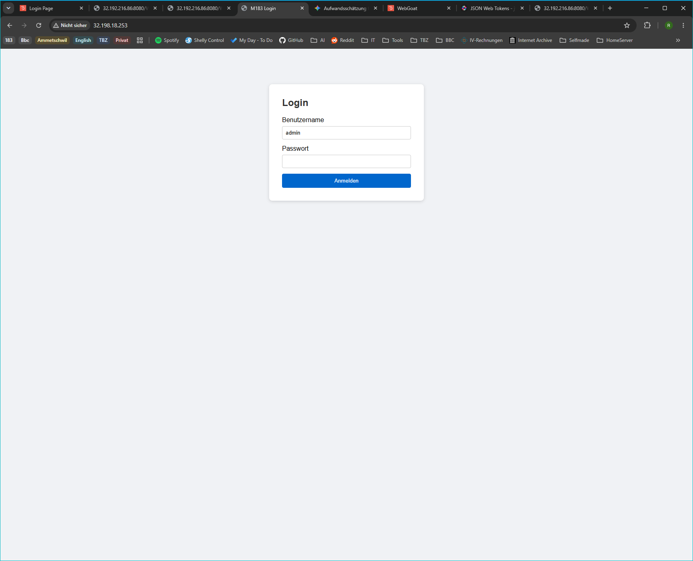

- Screenshot der vollständigen Ausgabe des Brute-Force-Scripts (Fortschritt und gefundenes Passwort sichtbar).

    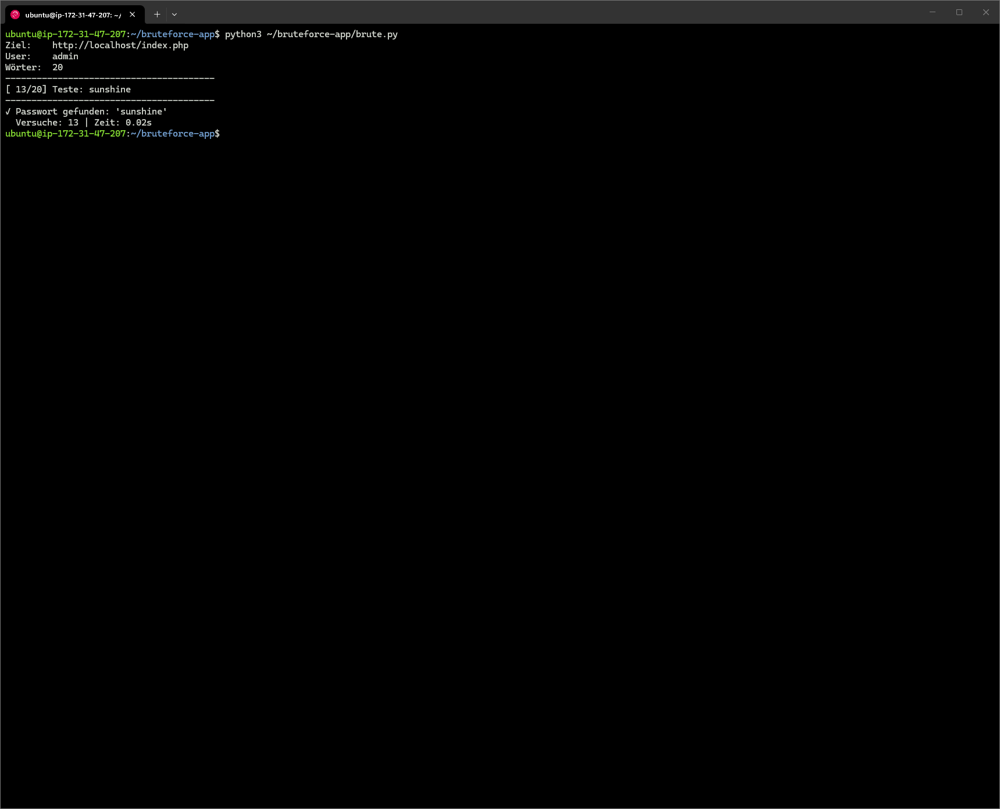
- Screenshot des erfolgreichen Logins im Browser mit dem gefundenen Passwort.
    
- Schriftliche Antworten auf die drei Fragen:
    1. Wie viele Versuche und wie viele Sekunden hat der Angriff benötigt? Was würde passieren, wenn die Passwortliste statt 20 Einträgen 1 Million hätte (z.B. die bekannte `rockyou.txt`)?

        **Beobachtung:** _Der Angriff benötigte 13 Versuche und 0.02 Sekunden_

        **Skalierung auf 1 Million Einträge:** _Wenn das Skript für 13 Versuche 0.02 Sekunden benötigt, schafft es 650 Anfragen pro Sekunde. Für 1 Million Einträge würde es also ca. 1538 Sekunden oder 25.6 Minuten dauern._
        
        **Anfragen pro Sekunde**

        $$R_s = \frac{\text{Versuche}}{\text{Zeit}} = \frac{13}{0.02\,\text{s}} = 650\,\text{Anfragen/s}$$
        
    
        **Hochrechnung für 1 Million Einträge**

        $$T_{\text{Gesamt}} = \frac{\text{Gesamte Einträge}}{R_s} = \frac{1'000'000}{650\,\text{Anfragen/s}} \approx 1538.46\,\text{Sekunden} \approx 25.6\,\text{Minuten}$$

    2. Welche **zwei technischen Massnahmen** hätten diesen Angriff verhindert oder massgeblich erschwert? (Hinweis: schauen Sie sich den Kommentar im PHP-Code an)

        **Rate-Limiting (Anzahl Anfragen drosseln):** _Der Server erlaubt pro IP-Adresse oder Benutzerkonto nur eine bestimmte Anzahl von Login-Versuchen innerhalb eines Zeitfensters (z. B. maximal 5 Versuche pro Minute). Jede weitere Anfrage wird mit dem HTTP-Status `429 Too Many Requests` blockiert. Dies macht automatisierte Brute-Force-Angriffe zeitlich unmöglich._

        **Account-Lockout (Kontosperrung) / CAPTCHA:** _Nach einer vordefinierten Anzahl von Fehllogins (z. B. 3 oder 5 Fehlversuche) wird das betroffene Benutzerkonto für eine gewisse Zeit (z. B. 15 Minuten) komplett gesperrt. Alternativ kann ein CAPTCHA vorgeschaltet werden, das von automatisierten Skripten nicht gelöst werden kann._

    3. Warum ist das Passwort `sunshine` schwach – auch wenn es kein Wort wie `password` oder `123456` ist?

        - **Wörterbuch-Wort:** _`sunshine` ist ein regulärer Begriff aus der englischen Sprache. Automatisierte Angreifer nutzen für Brute-Force- und Wörterbuch-Angriffe standardisierte Wortlisten (wie z. B. `rockyou.txt`), die Millionen solcher alltäglichen Wörter, Begriffe aus der Popkultur und echten Datenlecks enthalten._

        - **Keine Komplexität:** Das Passwort besteht ausschliesslich aus Kleinbuchstaben. Es fehlen Grossbuchstaben, Zahlen und Sonderzeichen, was die Kombination für Angreifer extrem leicht vorhersehbar macht.

        - **Geringe mathematische Entropie:** Da es sich um ein logisches, existierendes Wort und keine zufällige Zeichenfolge handelt, ist der mathematische Zufallsgehalt (die Entropie) des Passworts extrem niedrig. Es gehört weltweit zu den am häufigsten verwendeten Passwörtern und wird von Cracker-Tools in Sekundenbruchteilen erraten.

---
---

## B AES-256 symmetrische Verschlüsselung

- Screenshot der vollständigen Ausgabe des Skripts (Klartext, Schlüssel, Ciphertext und Manipulations-Test sichtbar).

    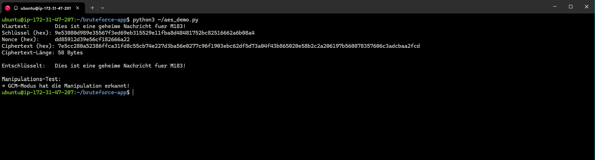

- Schriftliche Antworten auf die drei Fragen:
    1. Was ist ein Nonce und warum muss er für jede Verschlüsselung neu generiert werden?

        **Bedeutung:** _Ein Nonce (Number used once) ist eine eindeutige zufällige  oder fortlaufende Zahl, die bei einem Verschlüsselungsverfahren zusammen mit em geheimen Schlüssel verwendet wird._

        **Warum neu generieren?** _Wenn derselbe Schlüssel und derselbe Nonce für zwei unterschiedliche Nachrichten verwendet werden, führt dies bei vielen Krypto-Modi (wie AES-GCM) dazu, dass identische Klartext-Muster zu identischen Ciphertext-Mustern führen. Ein Angreifer könnte dadurch Nachrichten vergleichen, Muster erkennen oder sogar Teile des Klartexts mathematisch rekonstruieren (Replay-Angriffe und Key-Stream-Reconstruction). Der Nonce sorgt dafür, dass derselbe Klartext jedes Mal völlig anders verschlüsselt aussieht._

    2. Was ist der Unterschied zwischen DES (56-Bit-Schlüssel) und AES-256 (256-Bit-Schlüssel) in Bezug auf Brute-Force-Resistenz?

        **DES (56-Bit-Schlüssel):** _ Besitzt einen winzigen Schlüsselraum von nur $2^{56}$ (ca. $7.2 \times 10^{16}$) Möglichkeiten. Moderne Computer oder spezialisierte Hardware (ASICs) können diesen gesamten Schlüsselraum in wenigen Stunden vollständig durchsuchen. DES gilt daher seit Jahren als absolut unsicher._

        **AES-256 (256-Bit-Schlüssel):** _ Besitzt einen gigantischen Schlüsselraum von $2^{256}$ (ca. $1.1 \times 10^{77}$) Möglichkeiten. Um diese Zahl zu veranschaulichen: Selbst wenn man alle Supercomputer der Erde zusammenschalten würde, bräuchten sie astronomisch viel länger als das Alter des Universums, um den Schlüssel per Brute-Force zu erraten. AES-256 ist nach heutigem Stand der Wissenschaft absolut resistent gegen Brute-Force-Angriffe._

    3. Was demonstriert der Manipulations-Test am Ende des Skripts? Welchen Vorteil bietet GCM gegenüber einfachem AES-CBC?

        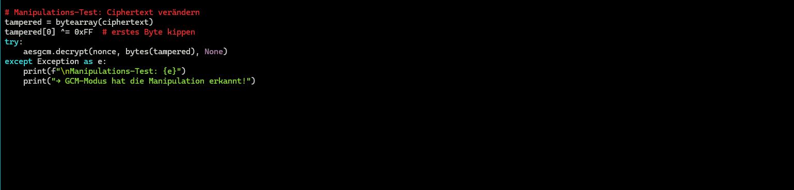

        **Demonstration des Tests:** _Der Test zeigt, dass der **GCM-Modus** (Galois/Counter Mode) eine Veränderung von auch nur einem einzigen Bit im Ciphertext sofort bemerkt. Er bricht die Entschlüsselung mit einer Fehlermeldung ab, anstatt korrupte Daten auszugeben._

        **Vorteil gegenüber AES-CBC:** _**AES-CBC** bietet nur Vertraulichkeit. Ein Angreifer kann den Ciphertext manipulieren (Bit-Flipping-Angriff). Der Empfänger entschlüsselt die manipulierten Daten zwar zu Fehlern oder veränderten Werten, merkt aber nicht zwingend, dass die Nachricht von einem Angreifer manipuliert wurde._

        - **AES-GCM** bietet Vertraulichkeit und Integrität (Authenticated Encryption). Es berechnet während der Verschlüsselung ein kryptographisches Siegel (Authentication Tag). Wird der Ciphertext manipuliert, passt das Siegel nicht mehr und die Manipulation fliegt sofort auf.

---
---

## C PKI-Zertifikatskette mit OpenSSL

- Screenshot der Ausgabe von `openssl x509 -text -noout` (Subject, Issuer und Validity sichtbar).
- Screenshot von `openssl verify` mit dem Ergebnis `OK`.

    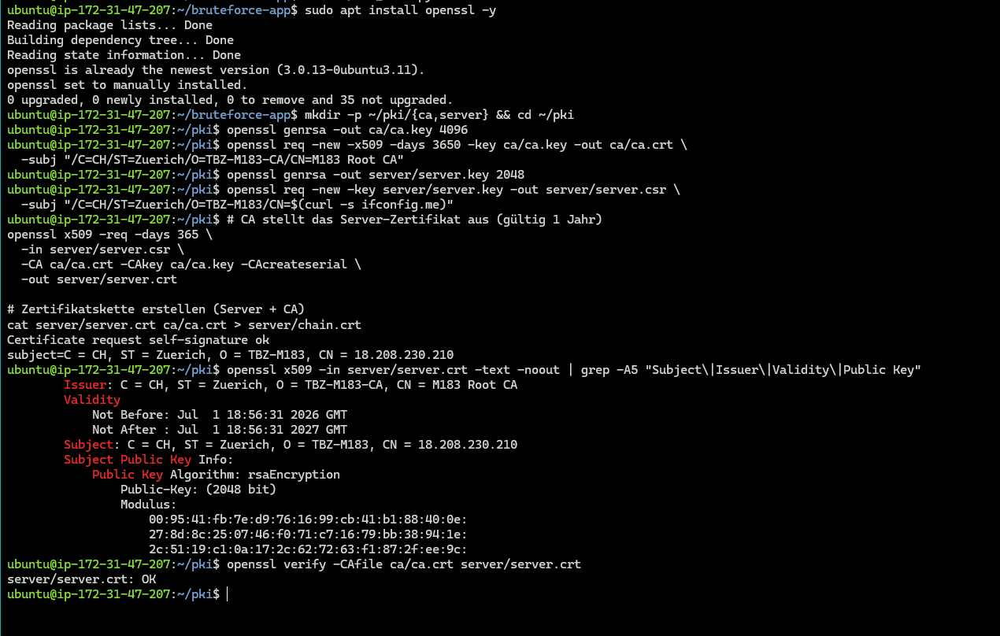
- Schriftliche Antworten auf die drei Fragen:

    1. Was ist der Unterschied zwischen einem selbstsignierten Zertifikat und einem CA-signierten Zertifikat?

        **Selbstsigniert vs. CA-signiert:** _Ein selbstsigniertes Zertifikat wird vom Besitzer selbst ausgestellt (kein Vertrauensanker). Ein CA-signiertes Zertifikat wird von einer vertrauenswürdigen Instanz (Certificate Authority) signiert, die die Identität des Antragsstellers prüft._

    2. Was enthält ein CSR (Certificate Signing Request) und wozu dient er?

        **CSR:** _Der Certificate Signing Request enthält den Public Key des Servers und Identitätsinformationen (z.B. Domainname). Er dient dazu, bei der CA offiziell ein Zertifikat zu beantragen, ohne den privaten Schlüssel übertragen zu müssen._

    3. Warum vertraut ein normaler Browser Ihrem selbst erstellten Zertifikat nicht, obwohl es technisch korrekt erstellt wurde?

        **Browser-Warnung:** _Der Browser hat eine Liste von vertrauenswürdigen Root-Zertifikaten ("Trust Store"). Da dein selbst erstelltes Root-CA-Zertifikat dort nicht eingetragen ist, stuft der Browser es als nicht vertrauenswürdig ein._

---
---

## D Nginx mit TLS konfigurieren

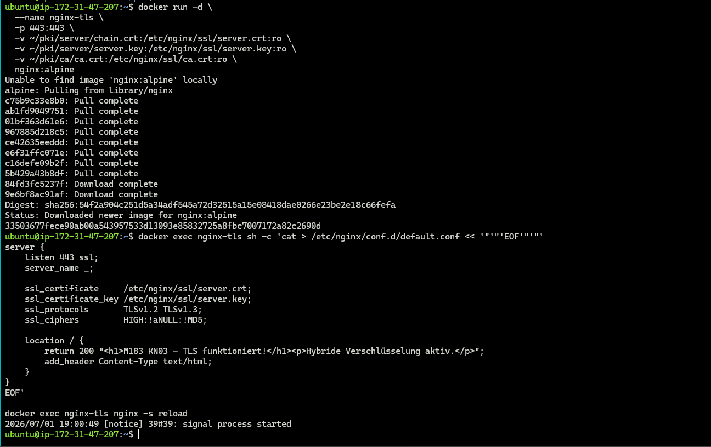

- Screenshot von `https://<IHRE-EC2-IP>` im Browser mit sichtbarer Sicherheitswarnung (oder der geöffneten Seite nach «Weiter»).

    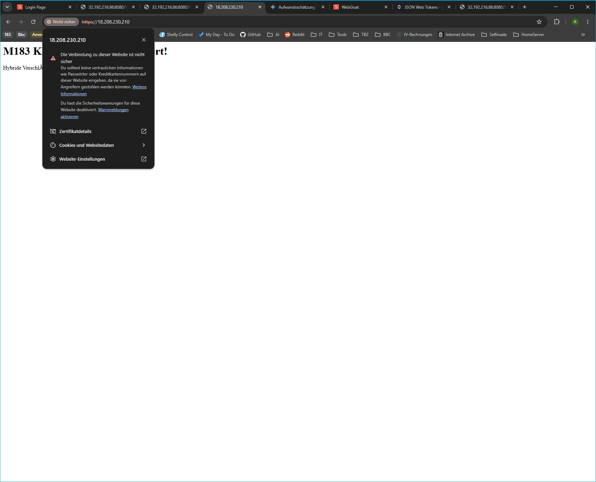
- Screenshot des Zertifikat-Dialogs im Browser (CN, Aussteller und Gültigkeit sichtbar).

    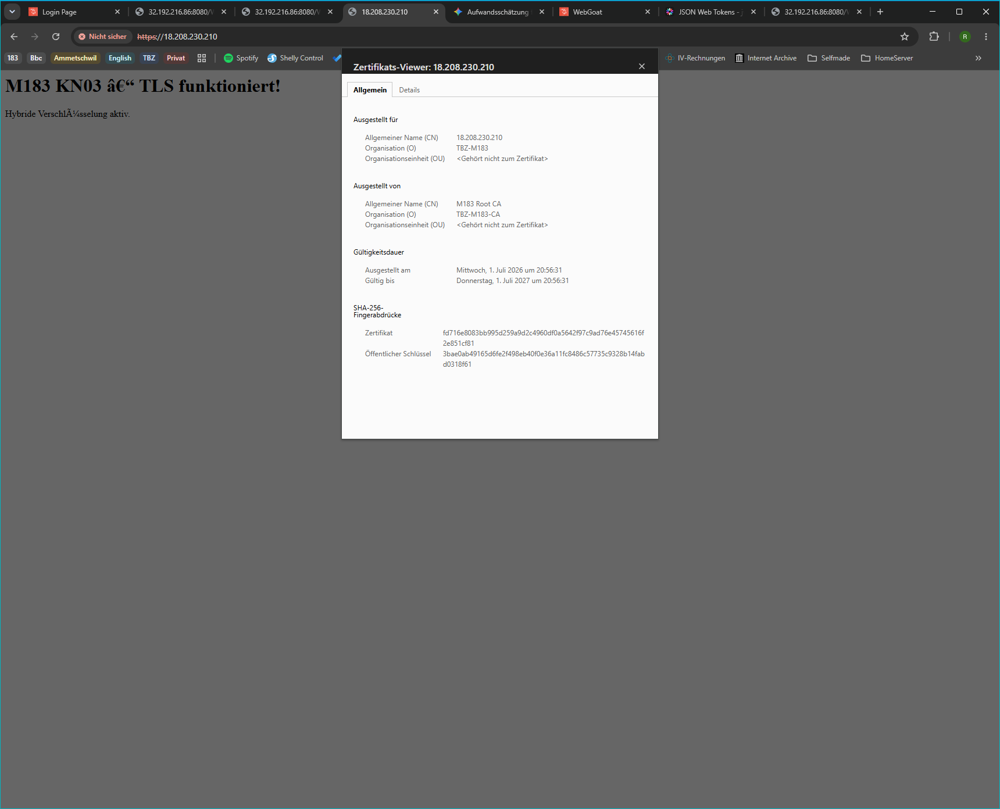

- Schriftliche Antworten auf die drei Fragen:
    1. Welche Informationen zeigt der Browser im Zertifikat-Dialog? Was davon haben Sie selbst in Aufgabe C definiert?

        **Zertifikats-Dialog:** _Er zeigt den Common Name (CN/Domain), den Aussteller (Issuer), den Gültigkeitszeitraum und den Fingerprint. Den CN (Servername) und den O (Organization) habe ich bei der Erstellung des CSR/Zertifikats selbst festgelegt._

    2. Warum erscheint trotz technisch korrektem Zertifikat eine Sicherheitswarnung?

        _Siehe C3 - die Kette endet bei einer unbekannten CA, die der Browser nicht kennt_

    3. Erklären Sie anhand dieses Setups, wie hybride Verschlüsselung bei HTTPS funktioniert (Schlüsselaustausch vs. Datenverschlüsselung).

        **Hybride Verschlüsselung:** _Asymmetrische Verschlüsselung (z.B. RSA/ECDH) wird nur für den Schlüsselaustausch genutzt, um sicher ein symmetrisches Passwort (Session-Key) zu vereinbaren. Die eigentliche Datenübertragung danach nutzt symmetrische Verschlüsselung (AES), da diese deutlich schneller ist._

---
---

## E HTTP vs HTTPS - Traffic live mitlesen

- Screenshot der vollständigen nmap-Ausgabe.
    
    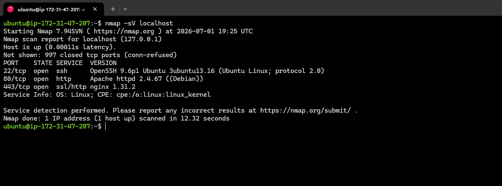

- Screenshot von Terminal 1 mit dem tcpdump-Output (Benutzername und Passwort müssen im Klartext sichtbar sein).

    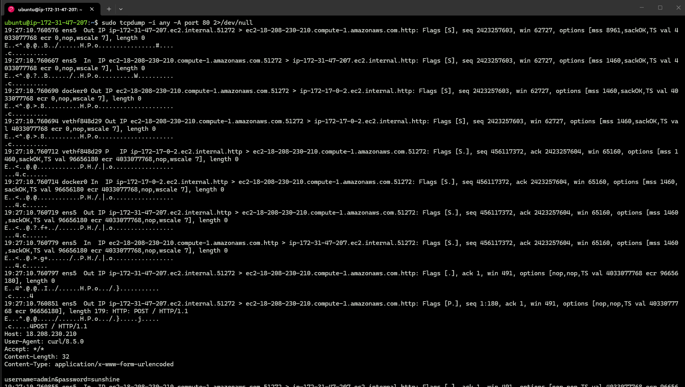

- Screenshot von Terminal 2 mit dem curl-Befehl.

    

- Screenshot von Terminal 1 mit dem tcpdump-Output auf Port 443 (verschlüsselte Bytes sichtbar, kein Klartext).

    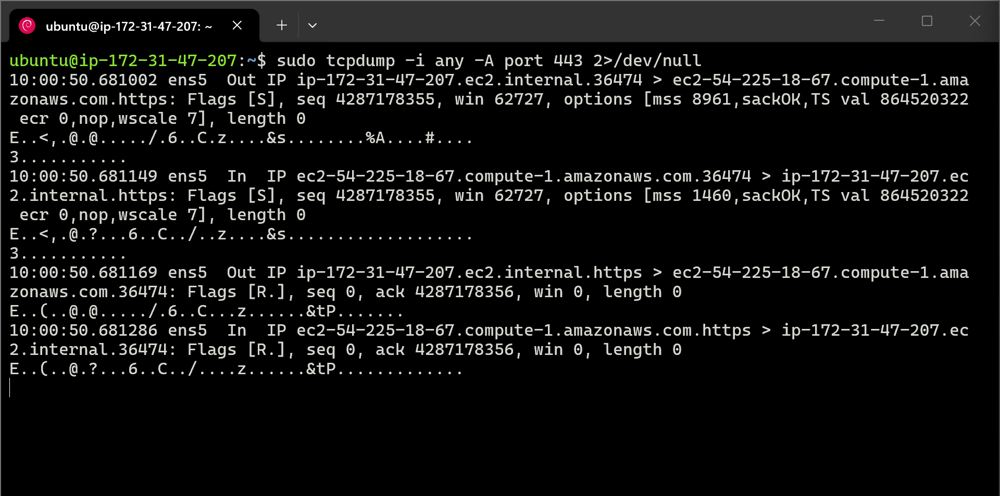

- Schriftliche Antworten auf die sechs Fragen:

    1. Was zeigt nmap über Port 80 und Port 443? Welche Information erhält ein Angreifer bereits durch einen Port-Scan, bevor er auch nur eine einzige Anfrage an die App gestellt hat?

        **nmap:** _Zeigt offene Ports. Ein Angreifer erkennt sofort, welche Dienste laufen und welche Versionen sie haben, was ihm hilft, gezielt nach bekannten Sicherheitslücken (Exploits) zu suchen._

    2. Was genau ist im tcpdump-Output sichtbar? Markieren Sie die Zeile, die das Passwort im Klartext enthält.

        **tcpdump (HTTP):** _Sichtbar ist das `POST`-Protokoll mit Parametern wie `username=admin&password=sunshine`. Der gesamte Body wird im Klartext übertragen._

    3. Was müsste ein Angreifer in einem realen Netzwerk tun, um diesen Traffic mitzulesen? (Stichwort: ARP-Spoofing / Man-in-the-Middle)

        **Reale Welt:** _Der Angreifer müsste sich in den Datenpfad bringen (Man-in-the-Middle), z.B. durch ARP-Spoofing im LAN oder durch Kontrolle über einen zwischengeschalteten Router._

    4. Was ist der Unterschied zwischen dem tcpdump-Output auf Port 80 und Port 443? Was sieht ein Angreifer beim HTTPS-Traffic?

        **Vergleich (HTTP vs. HTTPS):** _Bei HTTP ist der Inhalt lesbar. Bei HTTPS sieht ein Angreifer nur verschlüsselten Binär-Code (Ciphertext) und kann den Inhalt ohne den passenden Session-Key nicht entschlüsseln._

    5. Was passiert beim TLS-Handshake, bevor die eigentlichen Daten (Benutzername/Passwort) übertragen werden? (Stichwort: Hybride Verschlüsselung aus Aufgabe D)

        **TLS-Handshake:** _Hierbei einigen sich Client und Server auf die Verschlüsselungsparameter und tauschen (asymmetrisch) den symmetrischen Sitzungsschlüssel aus._

    6. Sie sehen bei Port 443 noch immer die IP-Adressen von Client und Server im tcpdump-Output. Warum ist das so, obwohl die Verbindung verschlüsselt ist?

        **IP-Adressen:** _Diese sind im TCP/IP-Header enthalten. Sie müssen im Klartext übertragen werden, damit die Router im Internet die Datenpakete überhaupt an das richtige Ziel zustellen können (Routing)._

---
---

## F Hash-Funktionen: MD5 cracken mit Python

- Screenshot der crack_md5.py-Ausgabe (geknackte Passwörter mit Benutzernamen und Hashes sichtbar).

    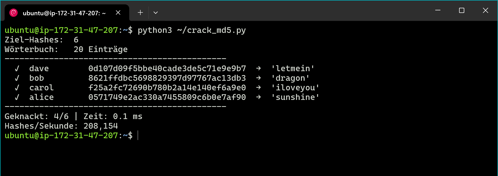
- Screenshot der Python-Ausgabe aus Schritt 6 (MD5 vs. scrypt Hashes/Sekunde und Hochrechnung).

    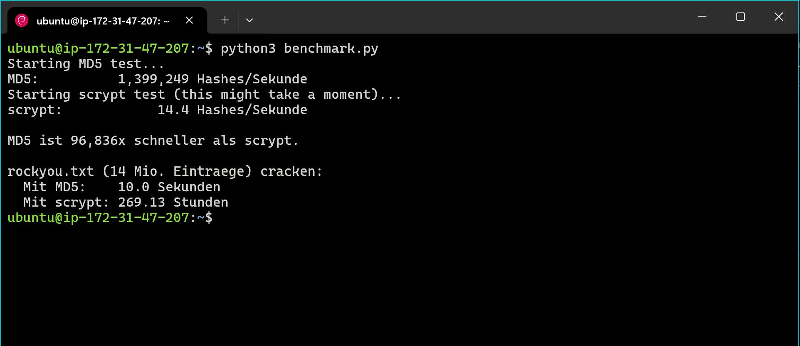

- Schriftliche Antworten auf die drei Fragen aus Schritt 4:
    1. Welche Passwörter wurden geknackt, welche nicht? Was unterscheidet die knackbaren Passwörter von franks Passwort?

        _Geknackt wurden kurze, häufige Passwörter. Franks Passwort ist eine lange "Passphrase" und daher nicht in der kleinen Wortliste enthalten._

    2. Das Script hat nur 20 Wörter geprüft. Die bekannte `rockyou.txt`-Wortliste hat 14 Millionen Einträge. Schätzen Sie anhand der gemessenen Hashes/Sekunde: Wie lange würde der gleiche Angriff mit `rockyou.txt` dauern?

        **Zeit für 14 Mio. Einträge:**
        $\frac{14.000.000}{1.453.414} \approx 9,6$ Sekunden.

    3. Franks Passwort ist lang und steht in keiner Wortliste – trotzdem ist der MD5-Hash grundsätzlich knackbar, es fehlt nur die richtige Liste. Welche zwei Massnahmen aus KN04 machen gestohlene Hashes unbrauchbar, selbst wenn der Angreifer sie hat?

        **Massnahmen:**
        - **Salt:** _Ein zufälliger Wert, der vor dem Hashing an das Passwort gehängt wird. Er macht Rainbow-Tables unbrauchbar._
        - **Key Stretching / langsamer Algorithmus::** _Algorithmen wie Argon2ID sind so konzipiert, dass sie absichtlich viel Zeit und Speicher verbrauchen, um Brute-Force-Angriffe extrem zu verlangsamen._
        